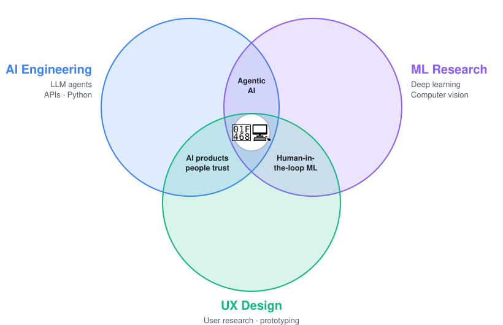

# Hi 👋, I'm Seyed
### AI Engineer · Machine Learning Researcher

Machine learning · Agentic AI · UX Research · Biomedical Imaging

---

### About me
I bring AI from research into real medical use. PhD researcher in AI for medical imaging at the University of Turku, focused on data scarcity and explainability. I combine UX research with AI engineering, so the systems I build are useful, clear and trusted.

  <picture>
    <source media="(prefers-color-scheme: dark)" srcset="intersection-dark.svg">
    
  </picture>

### Expertise & tech stack

<table>
<tr>
<td width="28%"><b>⚙️ Engineering & Tools</b></td>
<td>

 
REST APIs · NumPy · pandas · Linux · HPC & cloud computing
</td>
</tr>
<tr>
<td width="28%"><b>🧠 AI & Machine Learning</b></td>
<td>

 
Deep learning · computer vision · transfer learning · model evaluation
</td>
</tr>
<tr>
<td width="28%"><b>🤖 Agentic AI & LLMs</b></td>
<td>

 
Agent workflows · conversational interfaces · prompt design · human-in-the-loop
</td>
</tr>
<tr>
<td width="28%"><b>🎨 UX & Product Design</b></td>
<td>

 
Personas · user journeys · interaction design · requirements & acceptance criteria
</td>
</tr>
</table>
